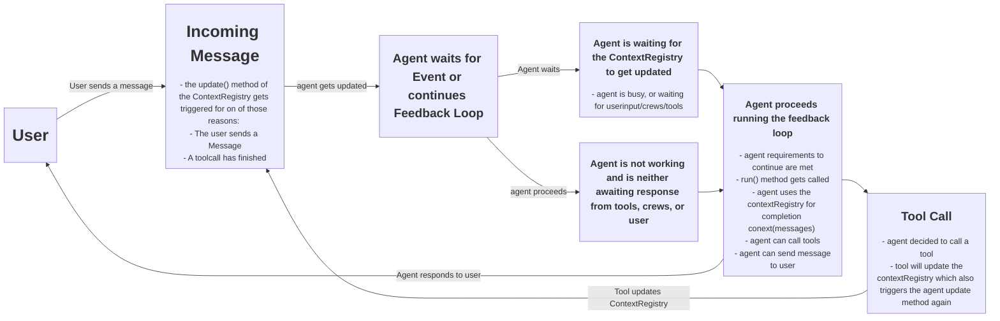
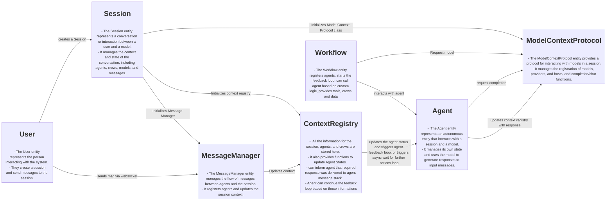

# Agent505

Agent505 is a platform for building and managing AI agents that can interact with users through websockets. It uses FastAPI, Pydantic, Uvicorn, and other libraries to provide a flexible and scalable environment for developing and deploying AI-powered applications.

With Agent505, you can:

- Create and manage AI agents with custom personalities and capabilities.
- Define workflows and interactions between agents and users.
- Connect agents to various data sources and tools.
- Build AI-powered applications that can automate tasks, provide information, and assist users in various domains.


## Overview
```
Agent505/
├── .env.sample
├── main.py
├── pyproject.toml
├── requirements.txt
├── setup.py
├── src/
│   ├── __init__.py
│   ├── server.py
│   └── session.py
└── stylegenie.egg-info/
    ├── dependency_links.txt
    ├── PKG-INFO
    ├── requires.txt
    ├── SOURCES.txt
    └── top_level.txt
```
The project is structured as follows:

- `Agent505/main.py`: This file contains the main application logic, including the Agent505 class, which manages sessions and agents.
- `Agent505/src/session.py`: This file defines the Session class, which manages the context and state of a conversation between a user and a model. It also defines the Agent class, which represents an autonomous entity that interacts with a session and a model to process messages and provide responses.
- `Agent505/src/server.py`: This file defines the FastAPI server and the ConnectionManager class, which manages the websocket connections.
- `Agent505/pyproject.toml`: This file contains the project's metadata, including its dependencies.

## Feedback Loop





## Dependencies

The project uses the following dependencies:

- python-dotenv
- fastapi
- pydantic
- uvicorn
- python-multipart
- openai
- litellm
- fastapi-sessions
- crewai
- mysql-connector-python

## Usage

To run the project, you need to install the dependencies and then run the main.py file.

```bash
pip install -r Agent505/requirements.txt
python Agent505/main.py
